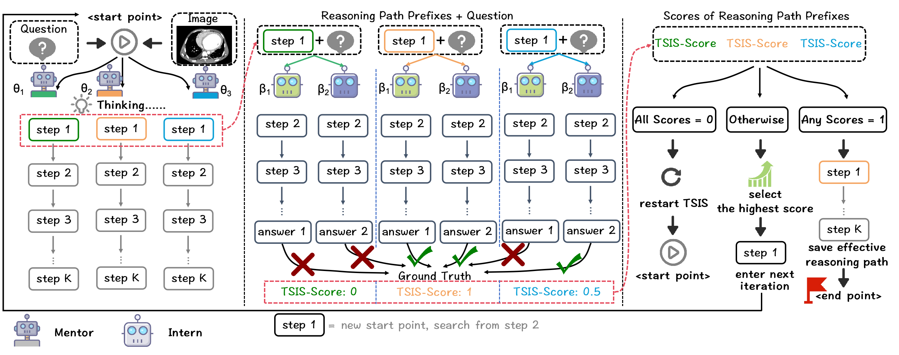
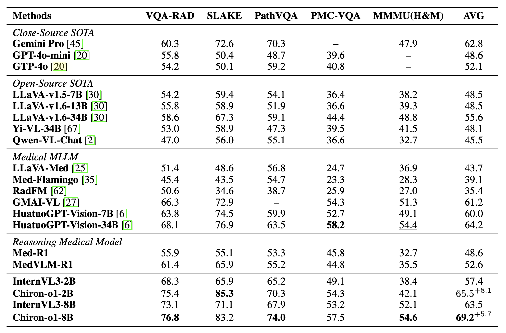
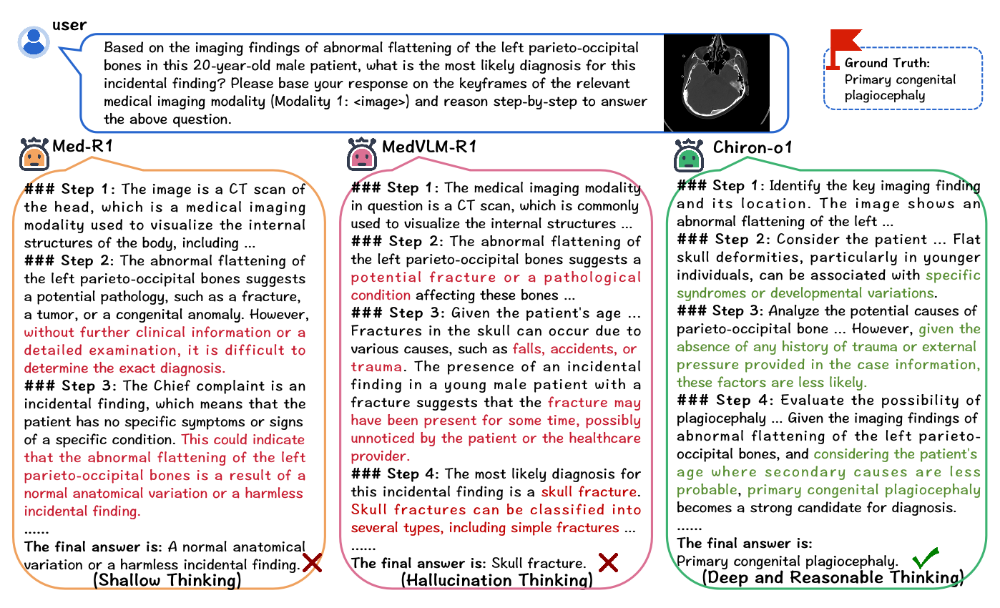
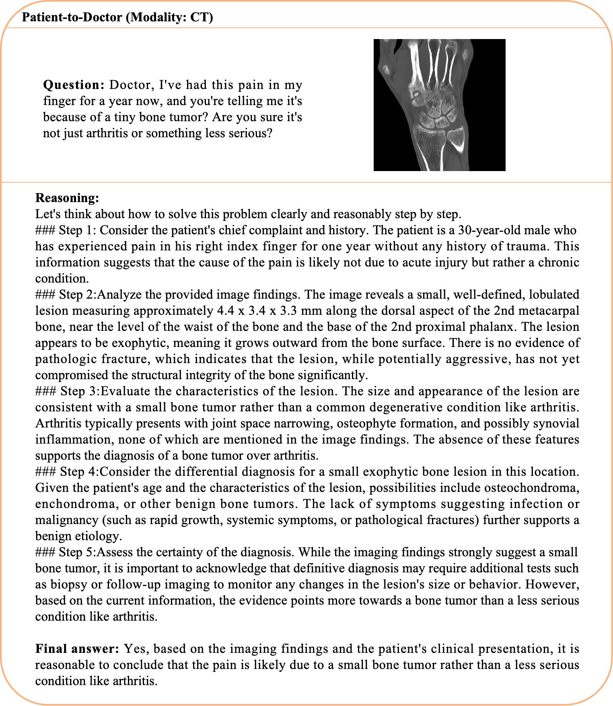

<div align="center">
<h1>  Chiron-o1: Igniting Multimodal Large Language Models towards Generalizable Medical Reasoning via Mentor-Intern Collaborative Search </h1>
</div>

<h4 align="center"> If you find this project useful, please give us a star🌟.<h4 align="center"> 


<p align="center">
📃 <a href="" target="_blank">Paper</a> ｜ 🤗 <a href="https://huggingface.co/manglu3935/Chiron-o1-2B" target="_blank">Chiron-o1-2B</a> ｜ 🤗 <a href="https://huggingface.co/manglu3935/Chiron-o1-8B" target="_blank">Chiron-o1-8B</a> ｜ 📧 <a href="mailto:manglu3935@126.com">Email</a>
</p>


## ⚡Introduction 



We propose **Mentor-Intern Collaborative Search (MICS)**, a new multi-model collaborative searching strategy designed to generate effective step-by-step CoT data. The core idea of MICS is leveraging multiple knowledgeable mentor models to collaboratively search for reasoning paths, while evaluating the searched paths based on feedback from intern models.

## 📚 Data Constrution with MICS


We provide the code for generating step-by-step CoT reasoning based on MICS. You can try out MICS reasoning with the data in `./src/demo_data`. 

Our MICS code now supports reasoning path search using [GPT-4o](https://openai.com/index/hello-gpt-4o/), [Gemini 2.5 Pro Preview](https://deepmind.google/models/gemini/pro/), [Qwen2.5-VL-72B-Instruct](https://huggingface.co/Qwen/Qwen2.5-VL-72B-Instruct) as mentor models and [Qwen25-VL-7B](https://huggingface.co/Qwen/Qwen2.5-VL-7B-Instruct), [Qwen2-VL-7B](https://huggingface.co/Qwen/Qwen2-VL-7B-Instruct), [Internvl3-8B](https://huggingface.co/OpenGVLab/InternVL3-8B) as intern models. (🌟 You can flexibly adjust it as needed. For details, see [this](https://github.com/manglu097/Chiron-o1/blob/main/src/model.py).)

**Due to [Radiopaedia](https://radiopaedia.org/)'s licensing, we do not directly provide the original dataset. Access to the original data containing the full dataset is restricted due to data licensing reasons. For access, please contact Radiopaedia to obtain a non-commercial license, and then reach out to the article authors.
```bash
# At least a GPU with more than 50G of memory is required; otherwise, you will need multiple GPUs. CUDA_VISIBLE_DEVICES='0,1'
python ./src/run.py \
--data_path './src/demo_data/demo.jsonl' \
--image_dir_path './src/demo_data/images' \
--output_path './src/demo_data/test/result.jsonl' \
# intern models
--qwen25_vl_7b_model_path 'Qwen/Qwen2.5-VL-7B-Instruct' \
--qwen2_vl_7b_model_path 'Qwen/Qwen2-VL-7B-Instruct' \
--internvl3_8b_model_path 'OpenGVLab/InternVL3-8B' \
# mentor models
--openai_api_key 'sk-xxx' \
--openai_base_url 'https://xxx' \
--qwen_api_key 'sk-xxx' \
--qwen_base_url 'https://xxx' \
--gemini_api_key 'sk-xxx' \
--gemini_base_url 'https://xxx' \
# judge model(default)
--ds_api_key 'sk-xxx' \
--ds_base_url 'https://api.deepseek.com' \
# At least two mentor models and at least one intern model.
# For models that are not needed, you can leave the corresponding parameter values blank (like '').
--mentor_models chatgpt-4o-latest google/gemini-2.5-pro-preview-03-25 qwen2.5-vl-72b-instruct \
--intern_models qwen25_vl_7b qwen2_vl_7b internvl3_8b
 
```

## 🏋️ Training
We use [InternVL](https://github.com/OpenGVLab/InternVL) to fine-tune the Chiron-o1 models. We provide the training instructions and configs [here](https://github.com/manglu097/Chiron-o1/tree/main/train). 

Specifically, for guidance on how to prepare the base model and custom data, please refer to the [official documentation](https://internvl.readthedocs.io/en/latest/internvl3.0/finetune.html).

```bash
git clone https://github.com/OpenGVLab/InternVL.git
cd InternVL/internvl_chat
# The custom data has been prepared
# Chiron-o1-2B (fine-tuning the LoRA requires 2x 32G/40G GPUs)
GPUS=8 PER_DEVICE_BATCH_SIZE=4 sh shell/internvl2.5/2nd_finetune/internvl2_5_2b_dynamic_res_2nd_finetune_lora.sh 
# Chiron-o1-8B (fine-tuning the LoRA requires 2 A100 80G GPUs)
GPUS=8 PER_DEVICE_BATCH_SIZE=2 sh shell/internvl2.5/2nd_finetune/internvl2_5_8b_dynamic_res_2nd_finetune_lora.sh 
```

## 🤔 Model
| Model             | Base Model                                                   | Link                                                       | GPU Memory   | 
| ----------------- | ------------------------------------------------------------ | ---------------------------------------------------------- | ------------ |
| Chiron-o1-2B      | [InternVL3-2B](https://huggingface.co/OpenGVLab/InternVL3-2B) | [Link](https://huggingface.co/manglu3935/Chiron-o1-2B)      | 8GB |  
| Chiron-o1-8B   | [InternVL3-8B](https://huggingface.co/OpenGVLab/InternVL3-8B) | [Link](https://huggingface.co/manglu3935/Chiron-o1-8B)   | 19GB |


We provide an example of pure text reasoning using [transformers](https://huggingface.co/docs/transformers/index). For multimodal tasks, you can refer to the information [here](https://github.com/manglu097/Chiron-o1/blob/main/infer.py).

```python
from transformers import AutoModel, AutoTokenizer
import torch

path = 'manglu3935/Chiron-o1-8B'
model = AutoModel.from_pretrained(
    path,
    torch_dtype=torch.bfloat16,
    load_in_8bit=False,
    low_cpu_mem_usage=True,
    use_flash_attn=True,
    trust_remote_code=True,
    device_map="auto").eval()
tokenizer = AutoTokenizer.from_pretrained(path, trust_remote_code=True, use_fast=False)

# pure text inference
question = "Which of the following imaging findings is most consistent with a pure arterial malformation (PAM)?\nA) A vascular network connecting arteries and veins with early venous drainage  \nB) A dilated, tortuous arterial loop without venous communication  \nC) A focal saccular outpouching of a cerebral artery with surrounding edema  \nD) A venous varix with adjacent arterial feeders\nLet's reason step-by-step to answer the above question."
generation_config = dict(max_new_tokens=1024, do_sample=True)
response = model.chat(tokenizer, None, question, generation_config)
print(f'User: {question}\nAssistant: {response}')
```


## 🧑‍⚖️ Evaluation 

You can use the script we provide in `./eval/eval.py` to evaluate the medical VQA benchmark (it may require slight modifications). Below are the specific instructions.

```bash
python ./eval/eval.py \
--vqa_json_path './eval/eval_data.json' \
--image_dir './eval' \
--model_path 'manglu3935/Chiron-o1-8B' \
--output_path './eval/output.json' \
--api_key 'sk-xxx' # DeepSeek is used to evaluate the correctness of the results
```

## 🏁 Results

We perform a series of comprehensive experiments using four high-performance baseline models: [HuatuoGPT-Vision](https://github.com/FreedomIntelligence/HuatuoGPT-Vision), [Med-R1](https://github.com/Yuxiang-Lai117/Med-R1), [MedVLM-R1](https://huggingface.co/JZPeterPan/MedVLM-R1), and others. The **Results** demonstrate the performance of the Chiron-o1 models compared to other cutting-edge models across various widely-used benchmarks, as illustrated in the table below.

<div align=center>

</div>

Compared to other multimodal medical reasoning models, Chiron-o1 demonstrates the ability to generate deep and reasonable reasoning paths, leading to correct answers.

<div align=center>

</div>


<div align=center>

</div>

## 🙏🏼 Acknowledgement

We gratefully acknowledge the inspiring work of [Transformers](https://github.com/huggingface/transformers), [InternVL](https://github.com/OpenGVLab/InternVL) and [Mulberry](https://github.com/HJYao00/Mulberry),  which have provided essential foundations and inspiration for this project. We also thank the developers of these outstanding tools for their contributions to open-source innovation.

## 📖 Citation

```
@article{sun2025enhancingstepbystepverifiablemedical,
  title={Enhancing Step-by-Step and Verifiable Medical Reasoning in MLLMs},
  author={Haoran Sun and Yankai Jiang and Wenjie Lou and Yujie Zhang and Wenjie Li and Lilong Wang and Mianxin Liu and Lei Liu and Xiaosong Wang},
  journal={arXiv preprint arXiv:2506.16962},
  year={2025}
}
```
